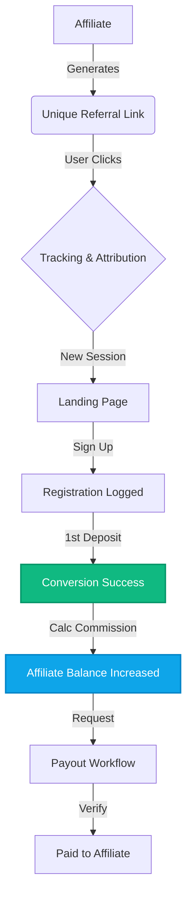

# 🏟️ Affiliate Panel Framework

A high-performance, production-ready Affiliate Dashboard System for online gaming ecosystems. Built with a clean modular architecture using React, Node.js, and Prisma.

---

## 📈 System Workflow

This diagram represents the core lifecycle of an affiliate referral through our system.



---

## 🛠️ Tech Stack

| Layer | Technologies |
| :--- | :--- |
| **Frontend** | React 18, TypeScript, Tailwind CSS, Vite, Recharts, Lucide |
| **Backend** | Node.js (Express), TypeScript, Prisma ORM |
| **Database** | PostgreSQL |
| **DevOps** | Docker, Docker Compose, Nginx |

---

## 🚀 Quick Start (Team Setup)

We have provided automation scripts to get you up and running in seconds.

### **Option 1: Manual Setup (Recommended for Dev)**

1. **Clone & Automate**:
   ```bash
   git clone <repo-url>
   # Windows
   .\setup.ps1
   # Linux/macOS
   chmod +x setup.sh && ./setup.sh
   ```

2. **Run Servers**:
   - Backend: `cd backend && npm run dev` (Port 5000)
   - Frontend: `cd frontend && npm run dev` (Port 5173)

### **Option 2: Docker Setup (Production/Staging)**

```bash
docker-compose up --build
```
- API: `http://localhost:5000`
- Dashboard: `http://localhost:80`

---

## 📖 API Documentation

The backend is self-documenting. View the Swagger specifications at:
`http://localhost:5000/api-docs`

---

## 🤝 Project Standards (For Team)

- **Language**: All code must be written in **TypeScript**.
- **Indentation**: 2 spaces (Enforced by `.editorconfig`).
- **Environment**: Always copy `.env.example` to `.env` before starting.
- **Commits**: Use conventional commits (e.g., `feat:`, `fix:`, `refactor:`).

## 📄 License & Contribution

- **License**: MIT
- See [CONTRIBUTING.md](./CONTRIBUTING.md) for detailed development guidelines.
